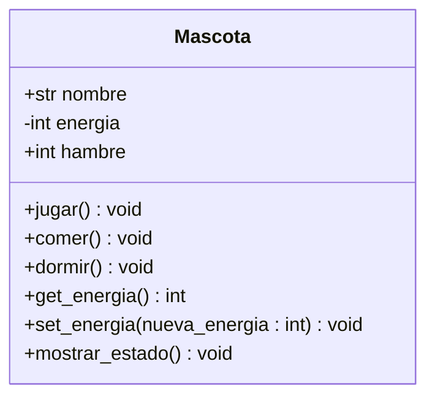

# DIAGRAMA ECHO EN CLASES
## CLASE: MASCOTA

# ¿Mi clase tiene relaciones con otras clases? ¿Por qué?

* Mi clase Mascota es independiente y no tiene relaciones con otras clases, ya que:

* No hay herencia, porque no estoy usando ninguna otra clase como base.
* Los atributos que tiene (nombre, energía y hambre) son datos simples, no objetos de otras clases.
* Los métodos no reciben ni utilizan objetos de otras clases como parámetros.
* Aunque tenga mascota1 y mascota2, todas son de la misma clase y no interactúan con otras clases diferentes.

Por eso, puedo decir que mi clase funciona de forma autónoma y no necesita relacionarse con otras clases dentro de este programa.
