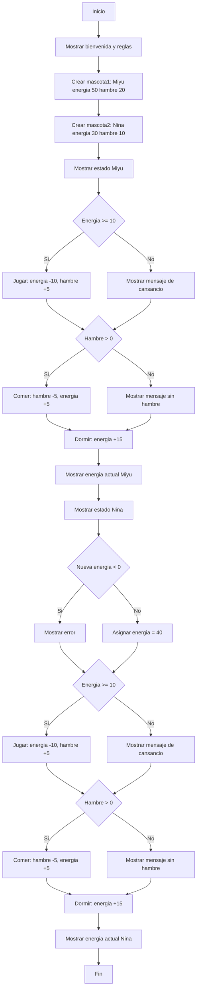

## Prompt Utizado para la generación del ejemplo de flujo

```mermaid

flowchart TD

A[Inicio] --> B[Mostrar bienvenida y reglas]

B --> C[Crear mascota1: Miyu energia 50 hambre 20]
C --> D[Crear mascota2: Nina energia 30 hambre 10]

D --> E[Mostrar estado Miyu]

E --> F{Energia >= 10}
F -- Si --> G[Jugar: energia -10, hambre +5]
F -- No --> H[Mostrar mensaje de cansancio]

G --> I{Hambre > 0}
H --> I

I -- Si --> J[Comer: hambre -5, energia +5]
I -- No --> K[Mostrar mensaje sin hambre]

J --> L[Dormir: energia +15]
K --> L

L --> M[Mostrar energia actual Miyu]

M --> N[Mostrar estado Nina]

N --> O{Nueva energia < 0}
O -- Si --> P[Mostrar error]
O -- No --> Q[Asignar energia = 40]

P --> R{Energia >= 10}
Q --> R

R -- Si --> S[Jugar: energia -10, hambre +5]
R -- No --> T[Mostrar mensaje de cansancio]

S --> U{Hambre > 0}
T --> U

U -- Si --> V[Comer: hambre -5, energia +5]
U -- No --> W[Mostrar mensaje sin hambre]

V --> X[Dormir: energia +15]
W --> X

X --> Y[Mostrar energia actual Nina]

Y --> Z[Fin]
```
